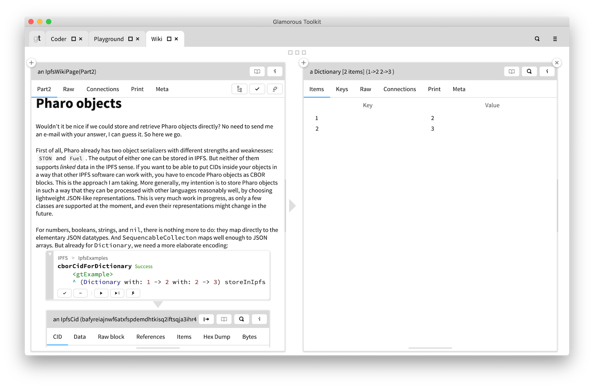

# An IPFS interface for Pharo



**Important note:** This is work in progress, written so far mainly to let me play with IPFS. Everything might change at any time. Don't rely on this package for mission-critical software!

## Installation

To use this package, your computer must run a local IPFS node. On a personal machine, [IPFS Desktop](https://github.com/ipfs-shipyard/ipfs-desktop) is the most convenient way to do so. Alternatively, or for running on a server, use the [command-line version](https://docs.ipfs.io/guides/guides/install/). You must have `go-ipfs` 0.10 or later, because of important changes in the HTTP API between versions 0.9 and 0.10.

### Pharo 8 or 9 without GToolkit support

Execute the following lines in a playground:

```
Metacello new
    baseline: 'IPFS';
    repository: 'github://khinsen/ipfs-pharo/src';
    load.
```

### Glamorous Toolkit

In a pre-built GToolkit installation (from [this site](https://gtoolkit.com/download/)), execute the following lines in a playground:

```
Metacello new
    baseline: 'IPFSForGToolkit';
    repository: 'github://khinsen/ipfs-pharo/src';
	 onConflictUseLoaded;
    load.
```

This installs the basic Pharo interface for IPFS plus inspector views for everything and a tutorial in a Lepiter database.

